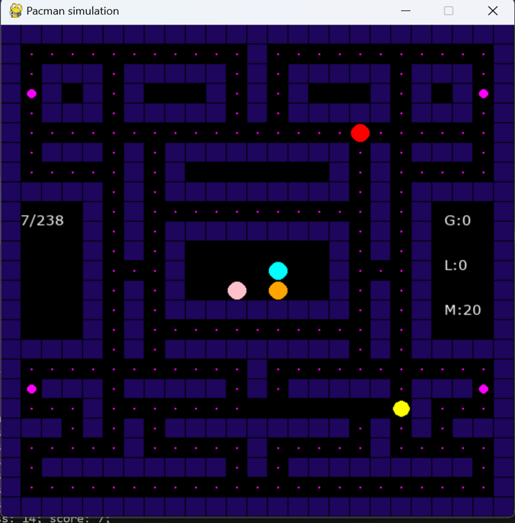
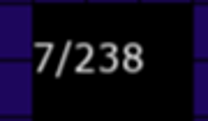
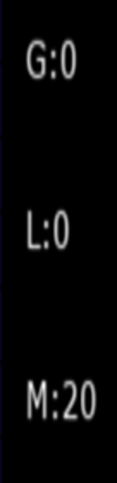
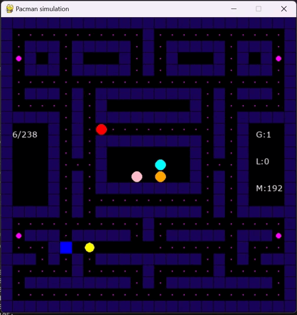

#  PacMan_Neat

PacMan_Neat - это проект, который объединяет классическую аркадную игру Pac-Man с искусственным интеллектом. Пакменом будет управлять не человек, а ИИ, используя алгоритм NEAT (NeuroEvolution of Augmenting Topologies).

# Запуск

1. **Скачайте ZIP** со всеми необходимыми файлами [здесь](https://github.com/GREBIAR-Git/PacMan_Neat/releases/download/1.0Neat/PacManNeat.zip)
2. Настройте **config-FeedForward.txt** под себя [здесь пояснения по полям](https://neat-python.readthedocs.io/en/latest/config_file.html)
3. Настройте **config.yml** под себя:
```yml
   LaunchWinningGenome: True/False # запускает победый геном (если он есть)
   LaunchCheckpoint: True/False # запускает контрольную точку (если она есть)
   CheckpointNumber : 24 # номер контольной точки
   EnableGhost: True/False # включает призраков
```
4. Запустите **main.exe**

# Запуск без ИИ

1. **Скачайте ZIP** со всеми необходимыми файлами [здесь](https://github.com/GREBIAR-Git/PacMan_Neat/releases/download/1.1/PacMan.zip)
2. Запустите **main.exe**

# Интерфейс

Общий вид:



| Объект        | Внешний вид   |
| ------------- |:-------------:|
| Пакмен        |  |
| Блинки      |      |
| Инки |       |
| Пинки |     |
| Клайд |       |
| Стена |       |
| Еда |       |
| Мега еда |       |
| Собрано еды/Всего еды |       |
| G - Текущее поколение; <br /> L - Поколений без улучшений;  <br /> M - Максимальное количество еды;|  |

# Демонстрация работы программы

<div align=center>

</div>

